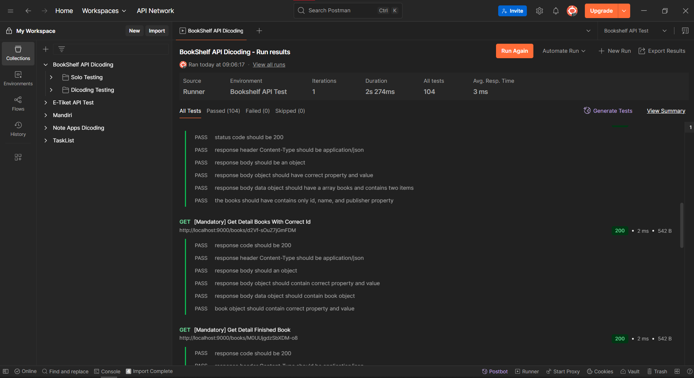
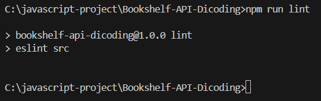

# 📚 Bookshelf API

Bookshelf API adalah proyek backend sederhana menggunakan **Hapi.js** yang dibuat sebagai bagian dari submission kelas **Belajar Membuat Aplikasi Back-End untuk Pemula dengan JavaScript** di Dicoding.

API ini memungkinkan pengguna untuk:
- Menambahkan buku
- Melihat seluruh buku
- Melihat detail buku
- Mengubah data buku
- Menghapus buku
- Mencari buku berdasarkan query ?name, ?reading, dan ?finished

## 🚀 Teknologi yang Digunakan

- [Node.js](https://nodejs.org/)
- [Hapi.js](https://hapi.dev/)
- [ESLint](https://eslint.org/) + [eslint-config-dicodingacademy](https://www.npmjs.com/package/eslint-config-dicodingacademy)
- [NanoID](https://github.com/ai/nanoid) — untuk generate ID unik

## 🗂️ Struktur Direktori

```
📁 Bookshelf-API-Dicoding
├── 📁 assets
│   ├── 📁 postman
|       ├── BookShelf API Dicoding.postman_collection.json
|       ├── BookShelf API Dicoding.postman_test_run.json
|       └── Bookshelf API Test.postman_environment.json
│   ├── eslint-result.png
│   └── Postman-result.png
├── 📁 src
│   ├── books.js
│   ├── handler.js
│   ├── routes.js
│   └── server.js
├── .gitignore
├── .eslintrc.config.mjs
├── package.json
├── package-lock.json
└── README.md
```

## 🧪 Postman Testing

Proyek ini telah diuji menggunakan **Postman** dengan *Collection* dan *Environment* dari Dicoding. Pengujian mencakup seluruh endpoint wajib dan opsional.

### ✅ Hasil Pengujian

- **Total Tes:** 104
- **Lulus:** 104
- **Gagal:** 0
- **Durasi:** ±2 detik



📁 File hasil pengujian dapat diakses:

[`BookShelf API Dicoding.postman_test_run.json`] (assets/postman/BookShelf API Dicoding.postman_test_run.json)

### 📦 File Pendukung Pengujian

- `BookShelf API Dicoding.postman_collection.json`
- `BookShelf API Dicoding.postman_test_run.json`
- `Bookshelf API Test.postman_environment.json`

## 📌 Cara Menjalankan Aplikasi

### 1. Clone repositori

```bash
git clone https://github.com/kandikaprima/Bookshelf-API-Dicoding.git
cd Bookshelf-API-Dicoding
```

### 2. Install dependencies

```bash
npm install
```

### 3. Jalankan server

```bash
npm run start
```

Server akan berjalan pada: `http://localhost:9000`

---

## ⚙️ Endpoint API

### ✅ Menambahkan Buku
- **Method:** POST  
- **URL:** `/books`

**Request Body:**
```json
{
    "name": "Buku A",
    "year": 2015,
    "author": "John Doe",
    "summary": "Lorem ipsum dolor sit amet",
    "publisher": "Indonesia Raya",
    "pageCount": 100,
    "readPage": 25,
    "reading": false
}
```

### ✅ Mendapatkan Semua Buku
- **Method:** GET  
- **URL:** `/books`
- **Query Opsional:**
  - `?name=searchTerm`
  - `?reading=1` atau `?reading=0`
  - `?finished=1` atau `?finished=0`

### ✅ Mendapatkan Buku berdasarkan ID
- **Method:** GET  
- **URL:** `/books/{id}`

### ✅ Mengubah Buku berdasarkan ID
- **Method:** PUT  
- **URL:** `/books/{id}`

### ✅ Menghapus Buku berdasarkan ID
- **Method:** DELETE  
- **URL:** `/books/{id}`

---

## ✅ ESLint & Style Guide

Proyek ini menggunakan ESLint dengan konfigurasi `eslint-config-dicodingacademy` agar gaya penulisan kode lebih konsisten.

- Jalankan ESLint:
```bash
npm run lint
```

- Jika ESLint tidak ada masalah:



---
